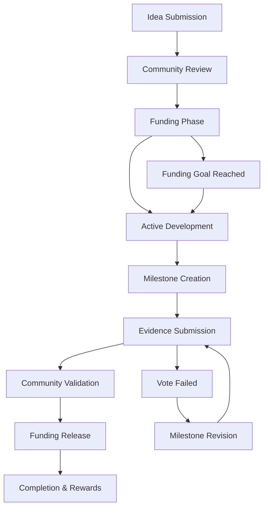

# 🚀 Decentralized Autonomous Innovation (DAI) Platform

A revolutionary blockchain-based ecosystem for autonomous innovation, funding, collaboration, and reward distribution built on the Stacks blockchain using Clarity smart contracts.

## 🌟 Vision

DAI transforms the innovation landscape by creating a **truly decentralized platform** where brilliant ideas meet capital, collaboration meets governance, and success meets fair reward distribution - all powered by smart contracts and community consensus.

## 🏗️ Platform Architecture

### Core Pillars

1. **💡 Innovation Proposals**: Submit breakthrough ideas with detailed specifications
2. **💰 Crowdfunding Engine**: Community-driven funding mechanisms
3. **🎯 Milestone Management**: Transparent progress tracking and validation
4. **🗽️ Decentralized Governance**: Stakeholder voting on key decisions
5. **🤝 Collaboration Network**: Multi-party contribution and reward sharing
6. **📊 Reputation System**: Merit-based innovator credentialing
7. **⚡ Autonomous Distribution**: Smart contract-based reward allocation

### Innovation Lifecycle



## 🔧 Smart Contract Features

### 🎭 Multi-Role Ecosystem

#### **Innovators** (Idea Creators)
- Submit innovation proposals with funding goals
- Create development milestones
- Provide completion evidence
- Manage collaborator partnerships
- Receive funding based on community approval

#### **Backers** (Funding Providers)
- Fund promising innovation proposals
- Vote on milestone completions
- Participate in governance decisions
- Earn reputation and potential returns
- Claim rewards based on success metrics

#### **Collaborators** (Technical Contributors)
- Join active projects with defined roles
- Receive percentage-based compensation
- Contribute specialized expertise
- Build collaborative innovation networks

### 🗽️ Democratic Governance Model

#### **Proposal Governance**
- Community voting on proposal viability
- Backer-weighted decision making
- Transparent voting history
- Configurable approval thresholds (default: 60%)

#### **Milestone Validation**
- Evidence-based completion verification
- Stakeholder voting with funding-weighted power
- Automatic funding release upon approval
- Community-driven quality assurance

#### **Platform Governance**
- Fee structure adjustments
- Governance threshold modifications
- Innovation fund distribution
- Platform policy updates

## 🚀 Getting Started

### Prerequisites

- [Clarinet 3.x](https://github.com/hirosystems/clarinet)
- [Stacks CLI](https://docs.stacks.co/docs/command-line-interface)
- Node.js and npm (for testing and development)

### Installation

1. **Clone the repository**
   ```bash
   git clone <your-repo-url>
   cd Decentralized-Autonomous-Innovation
   ```

2. **Verify contract**
   ```bash
   clarinet check
   ```

3. **Start development environment**
   ```bash
   clarinet integrate
   ```

4. **Run tests**
   ```bash
   npm install
   npm test
   ```

### Quick Start Guide

#### For Innovators

1. **Create Your Profile**
   ```clarity
   (contract-call? .Decentralized-Autonomous-Innovation create-innovator-profile 
     "Dr. Jane Innovator" 
     "AI researcher passionate about breakthrough machine learning applications"
     "Machine Learning, Computer Vision, Neural Networks")
   ```

2. **Submit Innovation Proposal**
   ```clarity
   (contract-call? .Decentralized-Autonomous-Innovation submit-proposal
     "Revolutionary Quantum-AI Hybrid Computing"
     "Developing a hybrid quantum-classical AI system that combines quantum computing advantages with machine learning to solve previously intractable problems in drug discovery, financial modeling, and climate simulation"
     "Quantum Computing"
     u100000  ;; 100,000 microSTX funding goal
     u4032)   ;; 28 days funding period
   ```

3. **Manage Project Milestones**
   ```clarity
   ;; Create milestone
   (contract-call? .Decentralized-Autonomous-Innovation create-milestone
     u1  ;; proposal-id
     "Quantum Circuit Design"
     "Design and simulate quantum circuits for hybrid computation"
     u25000  ;; 25% of funding allocation
     "Functional quantum circuit simulation with 95%+ accuracy")
   
   ;; Submit completion evidence
   (contract-call? .Decentralized-Autonomous-Innovation complete-milestone 
     u1  ;; milestone-id
     0x1234567890abcdef...)  ;; Evidence hash (research data, code, results)
   ```

#### For Backers

1. **Support Innovation**
   ```clarity
   (contract-call? .Decentralized-Autonomous-Innovation back-proposal
     u1      ;; proposal-id
     u5000)  ;; 5,000 microSTX backing
   ```

2. **Validate Milestones**
   ```clarity
   (contract-call? .Decentralized-Autonomous-Innovation vote-milestone
     u1     ;; milestone-id  
     true)  ;; approve completion
   ```

3. **Participate in Governance**
   ```clarity
   (contract-call? .Decentralized-Autonomous-Innovation vote-proposal
     u1     ;; proposal-id
     true)  ;; support proposal
   ```

#### For Collaborators

1. **Join Active Projects**
   ```clarity
   ;; Innovator adds collaborator
   (contract-call? .Decentralized-Autonomous-Innovation add-collaborator
     u1  ;; proposal-id
     'SP2COLLABORATOR123...  ;; collaborator principal
     "Lead Quantum Engineer"
     u25)  ;; 25% contribution share
   ```

## 📚 Comprehensive API Documentation

### Innovation Management

#### `create-innovator-profile(name, bio, expertise)`
Creates a comprehensive innovator profile with reputation tracking.
- **Parameters**: Personal details and expertise areas
- **Returns**: Success confirmation
- **Access**: Public

#### `submit-proposal(title, description, category, funding-goal, funding-period)`
Submits innovation proposal for community funding.
- **Parameters**: Project details and funding requirements
- **Returns**: New proposal ID
- **Access**: Public
- **Requirements**: Minimum funding goal (10,000 microSTX)

#### `get-proposal(proposal-id)`
Retrieves detailed proposal information.
- **Returns**: Complete proposal data structure
- **Access**: Read-only

### Funding & Backing

#### `back-proposal(proposal-id, amount)`
Provides funding support for innovation proposals.
- **Parameters**: Target proposal and funding amount
- **Returns**: Success confirmation
- **Requirements**: Sufficient STX balance, active funding period

#### `get-backer-info(proposal-id, backer)`
Retrieves backer's contribution details.
- **Returns**: Funding amount, date, and reward status
- **Access**: Read-only

### Milestone System

#### `create-milestone(proposal-id, title, description, funding-allocation, completion-criteria)`
Creates development milestone for active proposal.
- **Access**: Proposal innovator only
- **Returns**: New milestone ID

#### `complete-milestone(milestone-id, evidence-hash)`
Submits completion evidence for milestone validation.
- **Parameters**: Cryptographic hash of evidence
- **Access**: Proposal innovator only

#### `vote-milestone(milestone-id, approve)`
Community validation of milestone completion.
- **Access**: Project backers only
- **Voting Power**: Weighted by funding contribution

#### `release-milestone-funding(milestone-id)`
Automatically releases funds upon milestone approval.
- **Triggers**: 60%+ community approval
- **Distribution**: 95% to innovator, 5% platform fee

### Collaboration & Governance

#### `add-collaborator(proposal-id, collaborator, role, contribution-percentage)`
Adds team member to active project.
- **Access**: Proposal innovator only
- **Parameters**: Role definition and compensation share

#### `vote-proposal(proposal-id, approve)`
Participates in proposal governance decisions.
- **Access**: Project backers only
- **Purpose**: Strategic direction and policy votes

### Platform Information

#### `get-proposal-counter()` - Total proposals submitted
#### `get-milestone-counter()` - Total milestones created
#### `get-innovation-fund()` - Accumulated platform development fund
#### `get-platform-fee-percentage()` - Current platform fee (default: 5%)
#### `get-governance-threshold()` - Voting approval threshold (default: 60%)

### Admin Functions (Contract Owner Only)

#### `update-platform-fee(new-fee)`
Adjusts platform service fee (maximum: 15%).

#### `update-governance-threshold(new-threshold)`
Modifies voting approval requirements (50-90% range).

#### `distribute-innovation-rewards(amount, recipient)`
Distributes innovation fund to deserving contributors.

## 💰 Economic Model

### Fee Structure
- **Platform Fee**: 5% of milestone releases (adjustable)
- **Minimum Funding**: 10,000 microSTX per proposal
- **Voting Period**: 2,016 blocks (~14 days)
- **Governance Threshold**: 60% approval required

### Revenue Distribution
```
Milestone Funding Release:
├── 95% → Innovator/Collaborators
└── 5% → Platform Development Fund

Platform Fund Usage:
├── 40% → Ecosystem Development
├── 30% → Community Rewards
├── 20% → Platform Maintenance  
└── 10% → Emergency Reserve
```

### Reputation System
- **Initial Score**: 0 points for new innovators
- **Proposal Submission**: +1 reputation point
- **Successful Funding**: +5 reputation points
- **Milestone Completion**: +3 reputation points per milestone
- **Completed Innovation**: +20 reputation points
- **Community Recognition**: Bonus points for exceptional contributions

## 🎯 Use Cases & Applications

### 1. **Deep Tech Startups**
**Scenario**: Quantum computing research team needs development funding
- **Funding Goal**: 500,000 STX over 18 months
- **Milestones**: Hardware design, software stack, proof of concept, commercial prototype
- **Community**: Deep tech investors, quantum researchers, technology enthusiasts

### 2. **Social Impact Projects**
**Scenario**: Clean water innovation for developing regions
- **Funding Goal**: 50,000 STX for 6 months
- **Milestones**: Research, prototype, field testing, deployment strategy
- **Community**: Impact investors, environmental advocates, NGO partners

### 3. **Open Source Innovation**
**Scenario**: Next-generation blockchain privacy protocol
- **Funding Goal**: 200,000 STX over 12 months
- **Milestones**: Protocol design, implementation, security audit, testnet deployment
- **Community**: Crypto enthusiasts, privacy advocates, blockchain developers

### 4. **Medical Breakthrough Research**
**Scenario**: AI-driven drug discovery platform
- **Funding Goal**: 750,000 STX over 24 months
- **Milestones**: Algorithm development, validation studies, regulatory preparation
- **Community**: Healthcare investors, medical professionals, biotech companies

## 🛡️ Security & Trust

### Smart Contract Security
- **Access Control**: Role-based function restrictions
- **Financial Security**: Escrow-based funding with milestone validation
- **Governance Security**: Weighted voting prevents manipulation
- **Data Integrity**: Cryptographic evidence verification

### Trust Mechanisms
- **Transparent Funding**: All contributions publicly verifiable
- **Community Validation**: Milestone completion requires stakeholder approval
- **Reputation System**: Historical performance tracking
- **Evidence Requirements**: Cryptographic proof of milestone completion

### Risk Mitigation
- **Funding Caps**: Maximum proposal funding limits
- **Time Limits**: Automatic deadline enforcement
- **Voting Requirements**: Minimum participation thresholds
- **Dispute Resolution**: Community-driven conflict management

## 🔬 Testing & Validation

### Contract Testing Suite

```clarity
;; Complete workflow test
;; 1. Create innovator profile
(contract-call? .Decentralized-Autonomous-Innovation create-innovator-profile 
  "Test Innovator" "Bio" "Expertise")

;; 2. Submit proposal
(contract-call? .Decentralized-Autonomous-Innovation submit-proposal
  "Test Innovation" "Description" "Category" u20000 u144)

;; 3. Back proposal
(contract-call? .Decentralized-Autonomous-Innovation back-proposal u1 u20000)

;; 4. Create milestone
(contract-call? .Decentralized-Autonomous-Innovation create-milestone
  u1 "Milestone 1" "Description" u10000 "Criteria")

;; 5. Complete milestone
(contract-call? .Decentralized-Autonomous-Innovation complete-milestone 
  u1 0x1234567890abcdef1234567890abcdef12345678)

;; 6. Vote approval
(contract-call? .Decentralized-Autonomous-Innovation vote-milestone u1 true)

;; 7. Release funding
(contract-call? .Decentralized-Autonomous-Innovation release-milestone-funding u1)
```

### Edge Case Testing
- **Insufficient Funding**: Balance validation
- **Deadline Expiration**: Time-based access control
- **Double Voting**: Duplicate vote prevention
- **Invalid Parameters**: Input validation
- **Unauthorized Access**: Permission enforcement

## 🚧 Roadmap & Future Features

### Phase 2: Enhanced Capabilities
- **Multi-token Support**: Accept various cryptocurrencies
- **Cross-chain Integration**: Deploy on multiple blockchains
- **AI-Powered Matching**: Intelligent backer-proposal pairing
- **Advanced Analytics**: Success prediction and risk assessment

### Phase 3: Ecosystem Expansion
- **Innovation Accelerator**: Comprehensive startup support
- **Patent Integration**: IP protection and licensing
- **Marketplace Integration**: Connect with existing funding platforms
- **Mobile Application**: User-friendly mobile interface

### Phase 4: Global Scale
- **Institutional Features**: Enterprise-grade funding tools
- **Regulatory Compliance**: Full legal framework integration
- **Academic Partnerships**: University research collaboration
- **Government Integration**: Public sector innovation funding

## 📊 Success Metrics

### Platform KPIs
- **Total Proposals**: Number of innovations submitted
- **Funding Volume**: Aggregate STX raised for projects
- **Success Rate**: Percentage of fully funded proposals
- **Milestone Completion**: Average completion rate per project
- **Community Growth**: Active backer and innovator counts

### Innovation Metrics
- **Time to Funding**: Average funding completion time
- **Collaboration Rate**: Multi-party project percentage
- **Repeat Innovators**: Platform loyalty and satisfaction
- **Technology Categories**: Innovation diversity across sectors

## 🤝 Community & Governance

### Decentralized Governance
The DAI platform operates under **community governance** where major decisions are made through:

- **Proposal Voting**: Strategic direction and feature additions
- **Fee Adjustments**: Community consensus on platform economics
- **Policy Updates**: Governance rule modifications
- **Fund Distribution**: Innovation ecosystem investment decisions

### Community Roles

#### **Innovation Council**
- Experienced innovators and successful project leaders
- Provide mentorship and strategic guidance
- Review high-impact proposal submissions
- Champion platform development initiatives

#### **Technical Advisory Board**
- Blockchain and smart contract experts
- Security auditors and code reviewers
- Platform architecture and scaling advisors
- Integration and partnership technical leads

#### **Community Moderators**
- Facilitate discussions and resolve disputes
- Maintain platform quality and standards
- Support new user onboarding
- Coordinate community events and initiatives

## 🌍 Global Impact Vision

DAI aims to become the **world's leading decentralized innovation platform**, enabling breakthrough technologies that address humanity's greatest challenges:

### **Climate Solutions**
- Clean energy innovations
- Carbon capture technologies
- Sustainable manufacturing processes
- Environmental monitoring systems

### **Healthcare Advances**
- AI-driven drug discovery
- Precision medicine platforms
- Mental health solutions
- Global health accessibility tools

### **Social Equity**
- Financial inclusion technologies
- Education accessibility platforms
- Digital identity solutions
- Community empowerment tools

### **Space & Future Technologies**
- Space exploration innovations
- Quantum computing breakthroughs
- Neural interface developments
- Sustainable space technologies

## 📜 License

This project is licensed under the MIT License - see the [LICENSE](LICENSE) file for details.

## 🤝 Contributing

We welcome contributions from the global innovation community!

### Development Guidelines
1. **Fork the repository**
2. **Create feature branch** (`git checkout -b feature/amazing-innovation`)
3. **Commit changes** (`git commit -m 'Add revolutionary feature'`)
4. **Push to branch** (`git push origin feature/amazing-innovation`)
5. **Open Pull Request**

### Code Standards
- Follow Clarity best practices and conventions
- Include comprehensive test coverage
- Update documentation for new features
- Maintain backward compatibility
- Security-first development approach

## 📞 Support & Resources

- **GitHub Issues**: Bug reports and feature requests
- **Community Discord**: Real-time collaboration and support
- **Documentation**: Comprehensive guides and tutorials
- **Developer Blog**: Technical insights and platform updates
- **Academic Papers**: Research and innovation methodology

## 🙏 Acknowledgments

- **Stacks Foundation**: Blockchain infrastructure and development tools
- **Clarinet Team**: Smart contract development framework
- **Innovation Community**: Global network of innovators and backers
- **Open Source Contributors**: Platform development and enhancement

---

## 🔮 The Future of Innovation is Decentralized

**DAI represents a paradigm shift** from traditional centralized funding models to a truly democratic, transparent, and efficient innovation ecosystem. By leveraging blockchain technology, smart contracts, and community governance, we're creating a world where the best ideas receive the support they deserve, regardless of geographic location, institutional affiliation, or traditional gatekeepers.

**Join us in building the future of innovation** - where breakthrough ideas meet passionate communities, where collaboration drives success, and where rewards are distributed fairly based on contribution and impact.

---

**🚀 Ready to revolutionize innovation? Start building with DAI today!**

*Built with ❤️ for the global innovation community*

# Decentralized Autonomous Innovation

